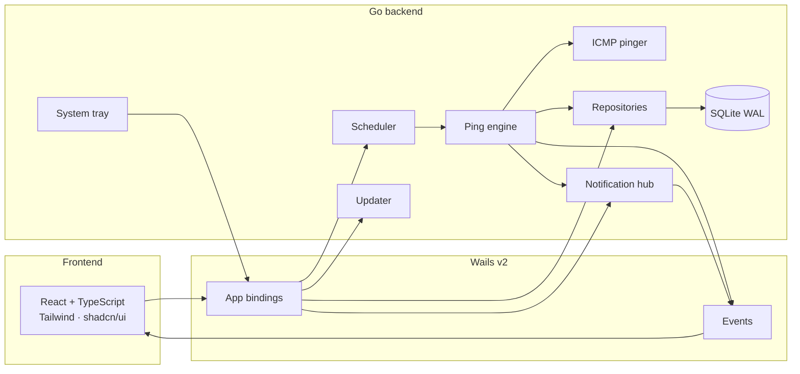

<div align="center">

# PingPulse

**Know when your infrastructure goes silent.**

A personal, cross-platform desktop monitor for IPs and hostnames.
Ping on a schedule. Catch real outages. Alert on your terms.

[](https://go.dev)
[](https://wails.io)
[](https://react.dev)
[](https://www.typescriptlang.org)
[](https://github.com/alikmndlu/PingPulse/releases/latest)
[](LICENSE)
[](https://github.com/alikmndlu/PingPulse/releases)

[Download](https://github.com/alikmndlu/PingPulse/releases/latest) · [Source](https://github.com/alikmndlu/PingPulse) · [Report an issue](https://github.com/alikmndlu/PingPulse/issues)

</div>

---

PingPulse is a native desktop app — not a SaaS, not a cloud agent, not a browser tab you forget to refresh. It lives in the system tray, pings your hosts with ICMP, stores history locally in SQLite, and can wake you through desktop toasts, SMS, webhooks, or Telegram.

Built for people who run their own boxes and want to know the moment one of them goes quiet.

## Why PingPulse

Most “uptime” tools assume a server, an account, and a monthly invoice. PingPulse assumes a laptop, a list of hosts, and the desire to keep secrets on disk.

| You want | PingPulse does |
| --- | --- |
| Know when a host is actually down | Failure / recovery thresholds, not a single missed ping |
| Keep running with the window closed | Scheduler + system tray |
| Own the data | Local SQLite, WAL mode, no telemetry |
| Get alerted without giving a vendor your network | Desktop, SMS HTTP, webhook, Telegram |
| Ship it to three operating systems | One Wails codebase, tagged GitHub Releases |

## Features

**Monitoring**
- Per-target ICMP ping: interval, timeout, retries, retry delay
- Status model: `online` · `offline` · `unknown` · `disabled`
- Configurable **failure threshold** and **recovery threshold** so flapping links do not spam you
- High-latency and timeout events, independent of offline detection
- Pause all checks, or stop the scheduler entirely, without losing targets

**Product surface**
- Live dashboard: counts, uptime %, next check, status donut, group filter
- Target list with enable/disable, mute, and groups
- Target details: latency area chart, availability strip, success/failure donut, recent events
- History with filters: target, status, date range, search
- JSON / CSV import and export (including group names)

**Operations**
- Dark / light theme
- Start on boot, start monitoring automatically, minimize to tray
- Global mute (1 hour) and per-target mute
- In-app updates from GitHub Releases
- Structured JSON logs with secret redaction

**Notifications**
- Desktop toasts (WinRT / AppleScript / `notify-send`)
- SMS over a generic HTTP API (Melipayamak-shaped defaults)
- Webhooks with JSON templates
- Telegram bots
- Per-kind cooldown so the same alert does not fire every interval

## Architecture

The React UI never talks to SQLite or ICMP. Wails bindings on `App` are the only bridge. The engine, scheduler, notifications, and database are independent Go packages.



```
internal/
  domain/          entities, validation, event names, mute helpers
  database/        SQLite open + SQL migrations
  repository/      targets, results, events, settings, notifications, groups
  monitor/         ICMP pinger, status evaluator, check engine
  scheduler/       one goroutine per enabled target, context cancellation
  notification/    provider interface + desktop / SMS / webhook / Telegram
  autostart/       Windows Run key, macOS LaunchAgent, Linux .desktop
  tray/            systray menu, offline count on the tooltip
  updater/         GitHub latest-release check + self-replace
  logging/         slog JSON + secret redaction
  config/          per-OS user data paths
  impex/           JSON / CSV import-export
  appicon/         generated pulse icon

frontend/src/
  pages/           Dashboard, Targets, History, Notifications, Settings
  components/      charts, groups, forms, shadcn primitives
  stores/          zustand (theme, monitoring, mute, refresh)
  services/api.ts  typed Wails wrappers
```

Startup path:

1. Resolve the user data directory and open `pingpulse.db`
2. Apply pending SQL migrations
3. Load settings, optionally enable autostart and start the scheduler
4. Start the tray
5. Frontend subscribes to live Wails events

## Quick start

### Download a build

Grab the latest asset for your OS from **[Releases](https://github.com/alikmndlu/PingPulse/releases/latest)**.

| OS | Asset | Run |
| --- | --- | --- |
| Windows x64 | `PingPulse-<tag>-windows-amd64.zip` | Extract and run `PingPulse.exe` |
| macOS universal | `PingPulse-<tag>-darwin-universal.tar.gz` | Extract and open `PingPulse.app` |
| Linux x64 | `PingPulse-<tag>-linux-amd64.tar.gz` | Extract, `chmod +x PingPulse`, run it |

Linux builds are linked against **WebKitGTK 4.1** (Ubuntu 24.04+, Fedora 40+, Debian 12+):

```bash
# Debian / Ubuntu 24.04+
sudo apt install libgtk-3-0 libwebkit2gtk-4.1-0

# Fedora 40+
sudo dnf install gtk3 webkit2gtk4.1
```

If macOS blocks the app: **System Settings → Privacy & Security → Open Anyway**.

### Develop from source

**Requirements**

| Tool | Version |
| --- | --- |
| Go | 1.25+ |
| Node.js | 24+ |
| pnpm | 10+ |
| Wails CLI | v2.15.0 |
| C compiler | MinGW-w64 (Windows), Xcode CLT (macOS), `gcc` (Linux) |

Linux also needs `libgtk-3-dev`, `libwebkit2gtk-4.1-dev`, and `libayatana-appindicator3-dev`. Windows needs WebView2 (already present on recent Windows 10/11). CGO is required for the Wails shell; SQLite itself is pure Go (`modernc.org/sqlite`).

```bash
git clone https://github.com/alikmndlu/PingPulse.git
cd PingPulse

go install github.com/wailsapp/wails/v2/cmd/wails@v2.15.0
go mod download
cd frontend && pnpm install && cd ..

wails dev
```

`wails dev` starts the Go backend, Vite, and hot reload. Bindings land in `frontend/wailsjs`.

Frontend-only (no live ping engine):

```bash
cd frontend
pnpm dev
```

## Using the app

| Screen | What it is for |
| --- | --- |
| **Dashboard** | Fleet pulse: online / offline / unknown / disabled, uptime, next check, group filter |
| **Targets** | Create, edit, enable, mute, group, and delete hosts |
| **Target details** | Latency series, availability strip, last events, one-off test ping |
| **History** | Every stored ping, filterable |
| **Notifications** | Provider credentials, templates, test send, alert kinds |
| **Settings** | Defaults, thresholds, theme, logging, autostart, tray, in-app updates |

**Quiet 1 hour** in the header mutes every channel globally. The same mute exists per target. Mutes expire automatically; they do not stop pinging, they only suppress alerts.

### Defaults

| Setting | Default |
| --- | --- |
| Interval | 120s |
| Timeout | 5s |
| Retries | 3 |
| Retry delay | 2s |
| Failure threshold | 3 consecutive failures → offline |
| Recovery threshold | 2 consecutive successes → online |
| Notification cooldown | 600s per target + kind |
| High-latency threshold | 500ms (off by default) |
| Theme | Dark |
| Log level | `info` |

Hosts are IPv4/IPv6 or DNS names. `http://` prefixes and trailing paths are stripped. Minimum interval is 5 seconds.

## ICMP notes

PingPulse uses [`prometheus-community/pro-bing`](https://github.com/prometheus-community/pro-bing).

- **Windows** — native ICMP (`SetPrivileged(true)`).
- **Linux / macOS** — unprivileged UDP ICMP when the OS allows it. Some hosts still need `CAP_NET_RAW` or root for raw ICMP.

A check that times out, fails DNS, or never receives a packet is a failed ping. The evaluator only marks a target **offline** after `failureThreshold` consecutive failures, and **online** again after `recoveryThreshold` consecutive successes. That is the difference between “the network hiccuped” and “the box is gone”.

## Notifications

Every channel implements the same interface:

```go
type Provider interface {
    Name() string
    Send(ctx context.Context, n domain.Notification) error
}
```

| Provider | How it delivers |
| --- | --- |
| **desktop** | WinRT toast (Windows), `osascript` (macOS), `notify-send` (Linux) |
| **sms** | Generic HTTP API. Defaults are shaped for Melipayamak |
| **webhook** | HTTP POST (or your method) with a JSON body template |
| **telegram** | Bot token + chat ID against `https://api.telegram.org` |

Alert kinds: `offline`, `recovery`, `high_latency`, `timeout`. Each kind can be toggled in Settings. Cooldown is per `(target, kind)`.

API keys live in SQLite on the local machine. They are never returned to the UI after save, never written to logs, and never hardcoded.

**Template variables**

`{{name}}` `{{host}}` `{{status}}` `{{failures}}` `{{latency}}` `{{lastSuccess}}` `{{time}}` `{{title}}` `{{body}}` `{{kind}}`

### Adding a provider

1. Implement `notification.Provider` under `internal/notification`.
2. Register it in `app.go` when constructing `notification.NewHub(...)`.
3. Add an enable flag on `domain.Settings` if the user should toggle it.
4. Persist extra fields through `NotificationRepository` if needed.
5. Expose the config through the existing Wails methods (or a small additive one).

Keep HTTP timeouts on the client. Never log secrets.

## Data, config, and logs

Nothing lives in env files. Everything is in the user data directory:

| OS | Directory |
| --- | --- |
| Windows | `%AppData%\PingPulse\` |
| macOS | `~/Library/Application Support/PingPulse/` |
| Linux | `~/.config/PingPulse/` |

| File | Purpose |
| --- | --- |
| `pingpulse.db` | SQLite, WAL, `foreign_keys=ON`, `busy_timeout=5000` |
| `pingpulse.log` | JSON logs, mode `0600`, secrets redacted |

Migrations are versioned SQL under `internal/database/migrations` and applied on startup.

| Table | Role |
| --- | --- |
| `targets` | Hosts, last status, consecutive counters, group, mute |
| `target_groups` | Named color groups |
| `ping_results` | Every check; pruned to the latest **2000 rows per target** |
| `events` | Offline / recovery / latency / timeout |
| `notification_configs` | Provider credentials and templates |
| `notification_cooldowns` | Last send per target + kind |
| `app_settings` | Single-row JSON blob |

There is no analytics, no crash reporter, and no network call except ICMP to *your* hosts, the notification endpoints *you* configure, and GitHub when you check for updates.

## In-app updates

Settings → **Check for updates** calls the public GitHub Releases API for [`alikmndlu/PingPulse`](https://github.com/alikmndlu/PingPulse/releases).

- Compares the running semver with `tag_name`
- Downloads only assets from `github.com/alikmndlu/PingPulse/releases/download/`
- Picks `windows-amd64.zip`, `linux-amd64.tar.gz`, or `darwin-universal.tar.gz`
- Replaces the running binary (or `.app` on macOS) and restarts

`wails dev` can *check*, but will not *install* — the process is a throwaway build. The first release that contains the updater must be installed by hand; later versions can update themselves.

Release CI stamps the version into the binary:

```text
-ldflags "-X pingpulse/internal/updater.Version=vX.Y.Z"
```

Local `wails dev` falls back to `internal/updater/version.go`. Keep that, `wails.json` `productVersion`, and `build/windows/info.json` in sync when you bump.

## Building

Current machine:

```bash
wails build
```

Cross-platform (from a matching or properly tooled host, CGO on):

```bash
wails build -platform windows/amd64 -webview2 embed
wails build -platform darwin/universal
wails build -platform linux/amd64 -tags webkit2_41
```

Output: `build/bin`.

| OS | Artifact | Desktop bits |
| --- | --- | --- |
| Windows | `PingPulse.exe` + WebView2 (embedded in CI) | Tray, WinRT toasts, start-on-boot |
| macOS | `PingPulse.app` | Tray, LaunchAgent, AppleScript notifications |
| Linux | `PingPulse` | GTK / WebKitGTK 4.1, `.desktop` autostart, `notify-send` |

## Releasing

Pushing a tag that matches `v*` runs [`.github/workflows/release.yml`](.github/workflows/release.yml): Windows, Linux, and macOS in parallel, then a GitHub Release with the three archives.

```bash
# 1. Bump Version in version.go, wails.json, build/windows/info.json
# 2. Commit and push main
git tag v1.1.0
git push origin v1.1.0
```

Wait for the **Release** workflow. Download from the Releases page, or let an already-updated install pick it up from Settings.

## Testing

```bash
go test ./internal/...
```

```bash
cd frontend
pnpm test
pnpm run build
```

Backend coverage includes status evaluation, failure/recovery thresholds, scheduler start/stop/pause, SMS HTTP delivery, cooldown, repositories, import parsing, and updater version/asset selection.

Frontend tests run under Vitest + Testing Library.

## Live events

The UI is event-driven. A 15s dashboard refresh is only a safety net.

| Event | When |
| --- | --- |
| `target:status_changed` | Evaluator transitions status |
| `target:ping_completed` | A check finished |
| `notification:sent` | A provider attempted delivery |
| `monitoring:started` | Scheduler is running |
| `monitoring:stopped` | Scheduler stopped or paused |
| `event:created` | An alert/recovery event was stored |
| `mute:changed` | Global or per-target mute changed |
| `groups:changed` | A group was created, updated, or deleted |
| `update:progress` | Update download percent |

## Stack

| Layer | Choice |
| --- | --- |
| Desktop shell | [Wails v2](https://wails.io) |
| Backend | Go 1.25, CGO for the webview only |
| Ping | `prometheus-community/pro-bing` |
| Database | `modernc.org/sqlite` |
| Tray | `energye/systray` |
| UI | React 18, TypeScript, Vite, Tailwind, shadcn/ui, Radix |
| Charts | Recharts |
| State | Zustand |
| Toasts | Sonner |
| CI | GitHub Actions → tagged Releases |

## Security posture

- Secrets stay in the local DB; the UI receives `apiKeySet`, not the key
- Logs redact `api_key`, `token`, `authorization`, `bearer`, `secret`, `password`
- Update downloads are host-allowlisted to this repo’s GitHub Releases
- Update archives reject zip-slip paths
- Data directory and log file are created with restrictive permissions
- Public Wails errors are sanitized; internal details stay in logs

This is a personal desktop tool. Treat the machine it runs on as the trust boundary.

## License

PingPulse is released under the [MIT License](LICENSE). Copyright (c) 2026 Ali Kamandlu.

---

<div align="center">

**PingPulse** — know when your infrastructure goes silent.

[Releases](https://github.com/alikmndlu/PingPulse/releases/latest) · [Issues](https://github.com/alikmndlu/PingPulse/issues)

</div>
